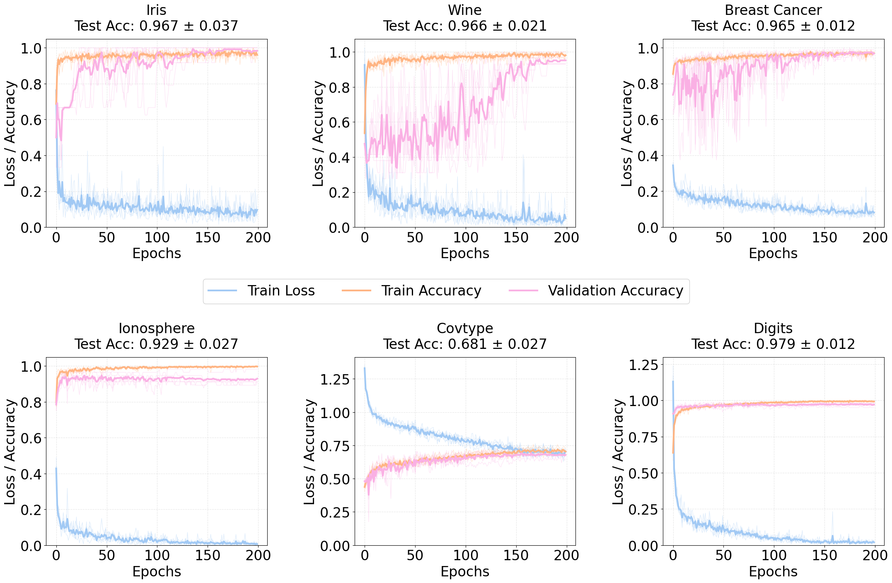

# Dimension reduction with structure-aware quantum circuits for hybrid machine learning

[](http://arxiv.org/abs/2508.00048)
[](https://opensource.org/licenses/mit)

Official implementation for the paper:  
**"Dimension reduction with structure-aware quantum circuits for hybrid machine learning"**  
*Ammar Daskin ([arXiv 2508.00048](https://arxiv.org/abs/2508.00048), July 2025.*

This repository implements a hybrid quantum-classical machine learning model that leverages tensor network decompositions for exponential dimensionality reduction. The quantum circuit component uses Schmidt decomposition to compress high-dimensional data before processing by a classical neural network.

## Key Features
- **Structure-aware quantum circuits**: Implements $k$-rank approximation via Schmidt decomposition
- **Exponential compression**: Reduces $2^n$-dimensional inputs to $n$-dimensional outputs
- **Hybrid architecture**: Combines quantum dimensionality reduction with classical neural networks
- **Cross-validation**: Includes robust k-fold validation pipeline
- **Visualization**: Generates publication-ready training plots

## Files
- `hybrid_model.py` hybrid machine learning model. It only depends on the following file
  - only uses `scmidt_decomposition.py` which applies successive Schmidt decomposition to compute tensor decomposition of a vector and number of terms required in hybrdi model
- `only_classical_head.....py` files for comparisons. They don't run quantum circuit
- `schmidt_circuit_optimization.py` find a circuit for dataset not used in hybrid model.

## Requirements

Install dependencies:
```bash
pip install torch pennylane numpy scikit-learn matplotlib seaborn
```

## Usage
### 1. Data Preparation
Implement dataset loading in `data_loaders.py` with the interface:
```python
def load_dataset(name: str) -> Tuple[np.ndarray, np.ndarray, int, int]:
    # Returns: X, y, n_qubits, n_classes
```

### 2. Run Cross-Validation
```python
from hybrid_model import cross_validate

# Load dataset
X, y, n_qubits, n_classes = load_dataset("iris")

# Run 5-fold cross-validation
accuracies, losses = cross_validate(
    X, y,
    n_qubits=n_qubits,
    n_classes=n_classes,
    schmidt_threshold=0.3,    # Coefficient cutoff
    hidden_dims=[64, 32],     # Classical NN architecture
    epochs=200,               # Training epochs
    lr=0.05,                  # Learning rate
    k_folds=5,                # Cross-validation folds
    dataset_name="iris"
)
```

### 3. Generate Results Plots
```python
from hybrid_model import plot_cv_results

plot_cv_results(accuracies, losses, "results_summary")
```


## Example Results


## Citation
If you use this code in your research, please cite:

```bibtex
@article{daskin2025dimension},
  title={Dimension reduction with structure-aware quantum circuits for hybrid machine learning},
  author={Daskin, Ammar},
  journal={arXiv preprint arXiv:2508.00048},
  year={2025},
}
```

## License
See [LICENSE](LICENSE) for details.

